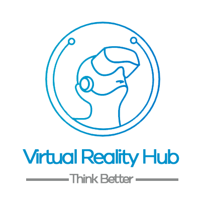
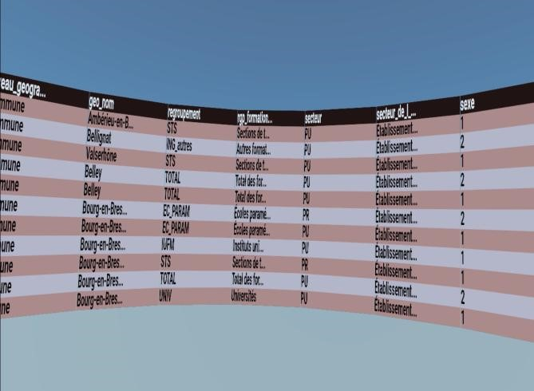
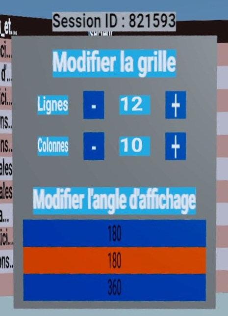
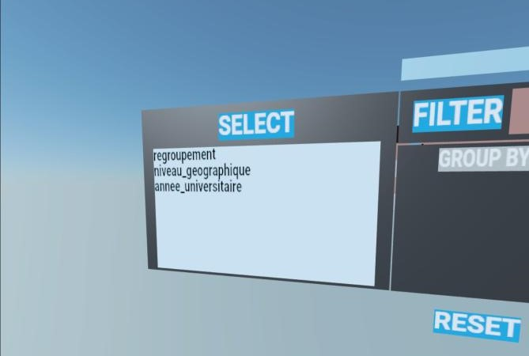
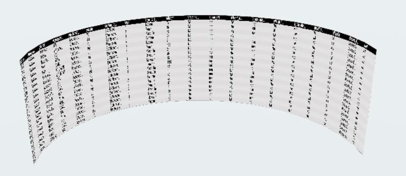
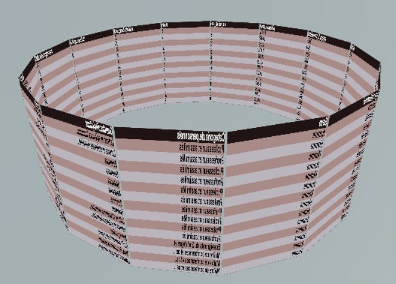
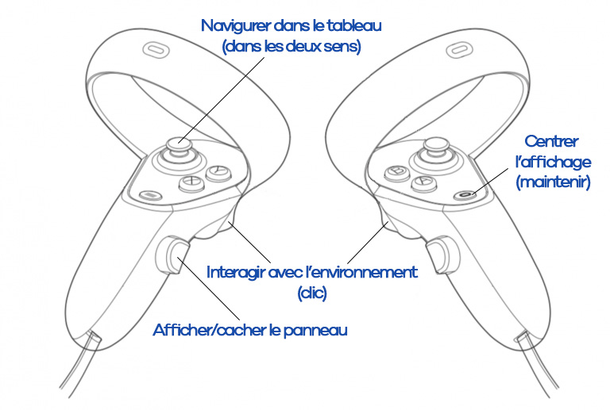

# Visualisation de données en réalité virtuelle

<p align="center">
  <br>
</p>

<p align="center">
  
  
</p>

## Equipe projet

**Baptiste CERDAN - Janos FALKE - Mikhail GAYDAMAKHA - Thomas STEINMETZ - Victor VOGT**

## Vue d'ensemble

Ce projet vise à utiliser la réalité virtuelle pour visualiser des tableaux conséquents issus de fichiers CSV envoyé depuis un serveur distant. 

## Captures d'écran







## Fonctionnalités

- Visualiser des données extraites d'un fichier CSV à distance => [dépot git côté serveur](https://git.unistra.fr/r-vr/r-in-vr-server-r). 
- Utiliser des commandes pour isoler vos recherches (select, filter,group by et summerize).
- Visualiser les données en 180 ou 360 degrés.

## Installation

Pour exécuter en local :

```sh
$ npm install
and
$ npm start
```

Pour exécuter en ligne :

```html
https://r-vr.pages.unistra.fr/r-in-vr-react-xr
```

## Utilisation
<p align="center">
  <br>
</p>

## Documentation 

Pour générer la documentation depuis la racine du projet :

```sh
$ jsdoc src -r -d docs
```
Puis ouvrez le fichier **index.html** dans le dossier **docs**.

## Licences

Université de Strasbourg - Master 2 Sciences et Ingénierie du Logiciel - Projet Master - 2021/2022
