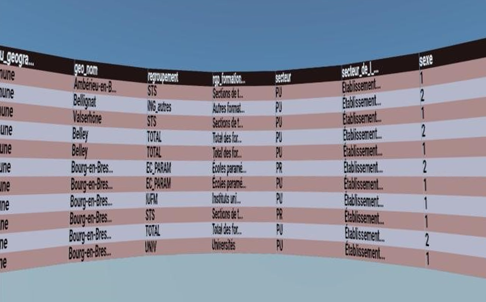
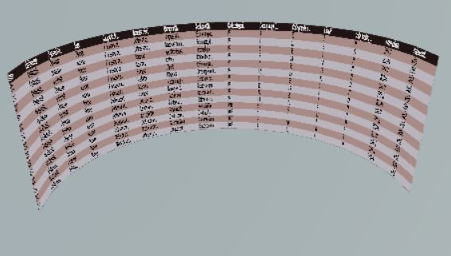

# Visualisation de données en réalité virtuelle

<p align="center">
  <br>
</p>

<p align="center">
  
  
</p>

## Contributors

**Baptiste CERDAN - Janos FALKE - Mikhail GAYDAMAKHA - Thomas STEINMETZ - Victor VOGT**

## General

This project is dedicated to CSV data visualization in virtual reality. 

## Screenshots







## Features

- Remote CSV data visualization => [remote git back-end](https://git.unistra.fr/r-vr/r-in-vr-server-r). 
- Use commands to isolate data (select, filter,group by et summerize).
- 180 or 360 degrees display.

## Installation

To run locally :

Make sure the back-end server is running and accessible.

```sh
$ npm install
and
$ npm start
```

## Use
<p align="center">
  <br>
</p>

## Documentation 

Generate documentation :

```sh
$ jsdoc src -r -d docs
```
Then open **index.html** in the **docs** folder.

## Licences

Université de Strasbourg - Master 2 Sciences et Ingénierie du Logiciel - Projet Master - 2021/2022
